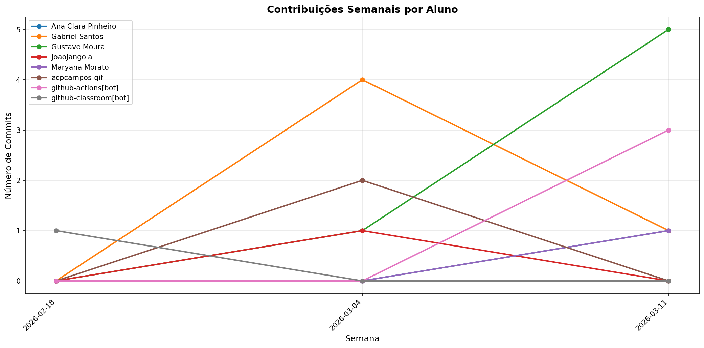

# 📊 Relatório de Contribuições do Projeto

**Última atualização:** 18/03/2026 12:46

---

## 📈 Resumo Geral de Contribuições

| Aluno                 |   Commits |   Linhas+ |   Linhas- |   Arquivos |   Docs Commits |   Docs Arquivos |
|-----------------------|-----------|-----------|-----------|------------|----------------|-----------------|
| Ana Clara Pinheiro    |         1 |         5 |         5 |          1 |              1 |               1 |
| Gabriel Santos        |         5 |       205 |       103 |          8 |              5 |               8 |
| Gustavo Moura         |         6 |        17 |        18 |          2 |              6 |               2 |
| JoaoJangola           |         1 |         4 |         4 |          1 |              1 |               1 |
| Maryana Morato        |         1 |         4 |         4 |          1 |              1 |               1 |
| acpcampos-gif         |         2 |       145 |        64 |          2 |              2 |               2 |
| github-actions[bot]   |         3 |        34 |        39 |          3 |              3 |               1 |
| github-classroom[bot] |         1 |      2152 |         0 |         45 |              1 |              13 |

## 📅 Contribuições Semanais (Todo o Semestre)

**2026-03-11**: Ana Clara Pinheiro: 1, Gabriel Santos: 1, Gustavo Moura: 5, Maryana Morato: 1, github-actions[bot]: 3

**2026-03-04**: Gabriel Santos: 4, Gustavo Moura: 1, JoaoJangola: 1, acpcampos-gif: 2

**2026-02-18**: github-classroom[bot]: 1

## 📊 Visualização Gráfica

## ℹ️ Observações

- **Commits**: Número total de commits realizados

- **Linhas+**: Linhas de código adicionadas

- **Linhas-**: Linhas de código removidas

- **Arquivos**: Número de arquivos únicos modificados

- **Docs Commits**: Commits em arquivos de documentação

- **Docs Arquivos**: Arquivos de documentação modificados

---

*Relatório gerado automaticamente via GitHub Actions*
