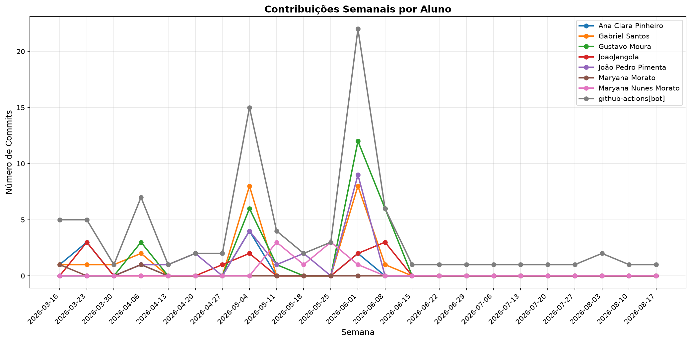

# 📊 Relatório de Contribuições do Projeto

**Última atualização:** 07/06/2026 22:30

---

## 📈 Resumo Geral de Contribuições

| Aluno                 |   Commits |   Linhas+ |   Linhas- |   Arquivos |   Docs Commits |   Docs Arquivos |
|-----------------------|-----------|-----------|-----------|------------|----------------|-----------------|
| Ana Clara Pinheiro    |        11 |      6756 |       150 |         36 |             10 |               4 |
| Gabriel Santos        |        25 |     10568 |      2627 |         83 |             20 |              11 |
| Gustavo Moura         |        28 |      3981 |       451 |         82 |             13 |               4 |
| JoaoJangola           |         9 |      2743 |        51 |         49 |              7 |               3 |
| João Pedro Pimenta    |        18 |     10360 |       107 |         31 |             10 |               2 |
| Maryana Morato        |         2 |         9 |         9 |          1 |              2 |               1 |
| Maryana Nunes Morato  |         8 |      1812 |        94 |         28 |              5 |               3 |
| acpcampos-gif         |         2 |       145 |        64 |          2 |              2 |               2 |
| github-actions[bot]   |        67 |       523 |       501 |          3 |             67 |               1 |
| github-classroom[bot] |         1 |      2152 |         0 |         45 |              1 |              13 |

## 📅 Contribuições Semanais (Todo o Semestre)

**2026-05-31**: Ana Clara Pinheiro: 2, Gabriel Santos: 8, Gustavo Moura: 12, JoaoJangola: 2, João Pedro Pimenta: 7, Maryana Nunes Morato: 1, github-actions[bot]: 20

**2026-05-24**: Maryana Nunes Morato: 3, github-actions[bot]: 3

**2026-05-17**: João Pedro Pimenta: 2, Maryana Nunes Morato: 1, github-actions[bot]: 2

**2026-05-10**: Ana Clara Pinheiro: 1, Gustavo Moura: 7, João Pedro Pimenta: 5, Maryana Nunes Morato: 3, github-actions[bot]: 10

**2026-05-03**: Ana Clara Pinheiro: 3, Gabriel Santos: 8, JoaoJangola: 2, github-actions[bot]: 9

**2026-04-26**: JoaoJangola: 1, github-actions[bot]: 2

**2026-04-19**: João Pedro Pimenta: 2, github-actions[bot]: 2

**2026-04-12**: João Pedro Pimenta: 1, github-actions[bot]: 1

**2026-04-05**: Ana Clara Pinheiro: 1, Gabriel Santos: 2, Gustavo Moura: 3, João Pedro Pimenta: 1, Maryana Morato: 1, github-actions[bot]: 7

**2026-03-29**: Gabriel Santos: 1, github-actions[bot]: 1

**2026-03-22**: Ana Clara Pinheiro: 3, Gabriel Santos: 1, JoaoJangola: 3, github-actions[bot]: 6

**2026-03-15**: Ana Clara Pinheiro: 1, Gabriel Santos: 1, Maryana Morato: 1, github-actions[bot]: 4

**2026-03-08**: Gustavo Moura: 6, JoaoJangola: 1

**2026-03-01**: Gabriel Santos: 4, acpcampos-gif: 2

**2026-02-15**: github-classroom[bot]: 1

## 📊 Visualização Gráfica

## ℹ️ Observações

- **Commits**: Número total de commits realizados

- **Linhas+**: Linhas de código adicionadas

- **Linhas-**: Linhas de código removidas

- **Arquivos**: Número de arquivos únicos modificados

- **Docs Commits**: Commits em arquivos de documentação

- **Docs Arquivos**: Arquivos de documentação modificados

---

*Relatório gerado automaticamente via GitHub Actions*
